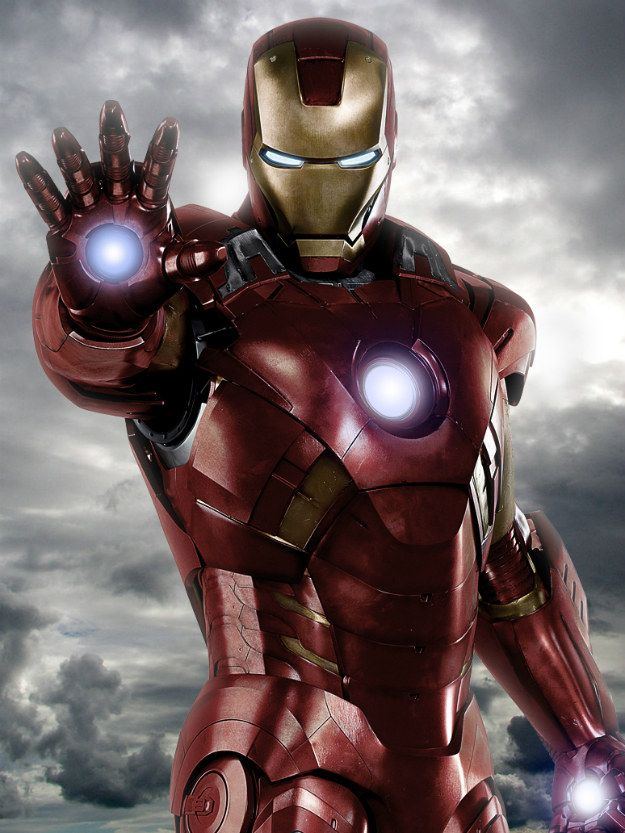
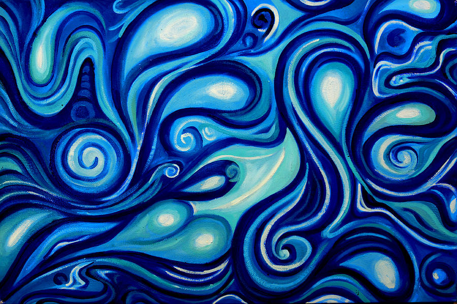
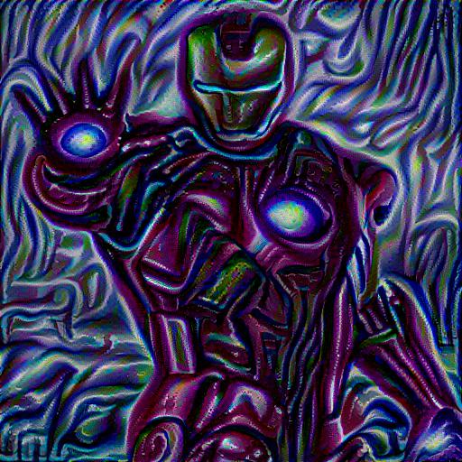

Implementation of Artistic Style Trasfer or Neural Style Transfer in Tensor Flow.

In this an image is generated by combining contents of one image with the artistic style of another image.

It uses the VGG19 Model, it can be downloaded from [here](www.vlfeat.org/matconvnet/models/imagenet-vgg-verydeep-19.mat)

Content Image:

Style Image:

Generated output Image:

